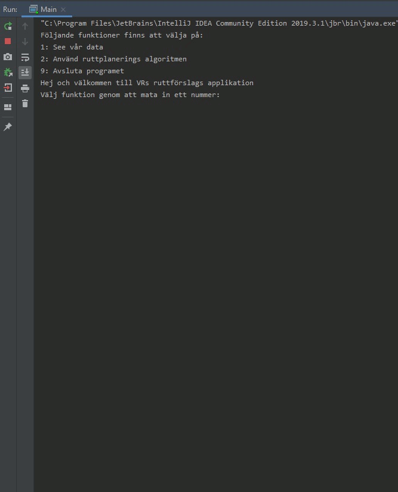

# Datastrukturer och algoritmer (2019-20)
###### PROJEKT 1 - RuttsökningFunktioner
Projekt 1 är ett java program som implimenterar A-star algoritmen för att hitta kortaste resvägen mellan olika stationer.

Uppgift
> Gör ett program som beräknar kortaste vägen med angiven data.

## Installation
Bygg som ett vanligt java projekt.

## Körning

## Contribution
School project, constructive criticism is welcome!

